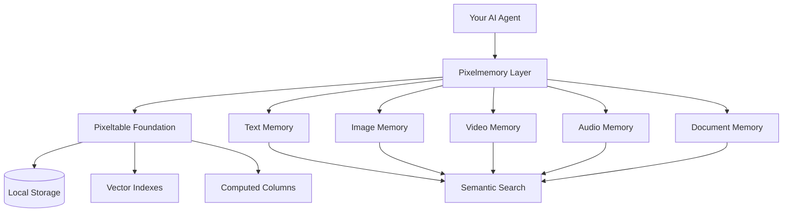
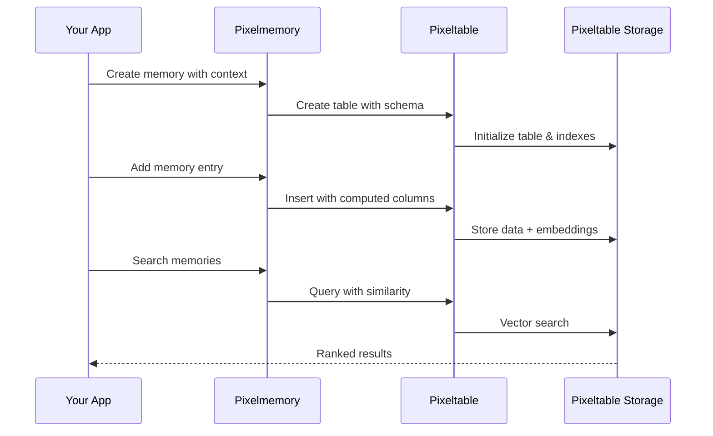

# Pixelmemory

**Reference Implementation: Multimodal Memory Layer Built on [Pixeltable](https://github.com/pixeltable/pixeltable)**

[](https://opensource.org/licenses/Apache-2.0)
[](https://pypi.org/project/pixelmemory/)
[](https://discord.gg/QPyqFYx2UN)

## Overview

Pixelmemory demonstrates how to build sophisticated memory layers using [Pixeltable's](https://github.com/pixeltable/pixeltable) declarative data infrastructure. This reference implementation shows how to create persistent, searchable, multimodal memory for stateful AI agents.



## Why Use Pixelmemory?

Most AI applications today are stateless - they forget everything between sessions. Pixelmemory solves this by providing:

- **Persistent memory** that survives between sessions
- **Semantic search** across all data types  
- **Local-first storage** with no vendor lock-in
- **Multimodal support** for text, images, videos, audio, documents
- **Production-ready** foundation built on Pixeltable

## Installation

```bash
pip install pixelmemory
```

*Note: Pixeltable is automatically installed as a dependency - no additional setup required.*

## Quick Start

```python
from pixelmemory import Memory
from pixelmemory.context import Text

# Define memory structure
context = [
    Text(id="content", embed=True),    # Searchable content
    Text(id="user_id", embed=False),   # Metadata
]

# Create memory instance
memory = Memory(context=context, namespace="chatbot")

# Add memories
entry = memory.Entry(content="I love Python programming", user_id="user_123")
memory.add(entry)

# Semantic search
results = memory.search("programming languages", min_score=0.5)
for r in results:
    print(r["score"], r["text"])
```

## Architecture



## Examples

### Basic Text Memory
```python
from pixelmemory import Memory
from pixelmemory.context import Text

context = [Text(id="content", embed=True)]
memory = Memory(context=context)

# Add and search
entry = memory.Entry(content="Learning about AI")
memory.add(entry)

# Semantic search
results = memory.search("artificial intelligence", min_score=0.3)
```

### Multimodal Memory
```python
from pixelmemory.context import Text, Image, Video

# Support multiple data types
context = [
    Text(id="description", embed=True),
    Image(id="screenshot", provider="openai", model="gpt-4o-mini"),
    Video(id="demo_video"),
]

memory = Memory(context=context, namespace="multimodal_app")
```

### Integration with LangChain
```python
from pixelmemory import Memory
from pixelmemory.context import Text
from langchain.chat_models import init_chat_model

# Persistent chat memory
context = [
    Text(id="session_id", embed=False),
    Text(id="messages", embed=False),
]

memory = Memory(context=context, namespace="langchain_chat")
model = init_chat_model("gpt-4o-mini", model_provider="openai")

# Chat with memory
def chat_with_memory(session_id: str, message: str):
    # Retrieve history, generate response, save back to memory
    # (See examples/integrations/langchain_chat_history.py)
    pass
```

## Example Files

All examples use the context-based API and are ready to run:

**Basic Examples** (no external dependencies):
- `examples/getting_started/01_basic_memory.py`
- `examples/multimodal/text.py`

**Multimodal Examples** (require OpenAI API key):
- `examples/multimodal/images.py`
- `examples/multimodal/video.py`
- `examples/multimodal/audio.py`

**Integration Examples**:
- `examples/integrations/langchain_chat_history.py` (requires OpenAI API key)
- `examples/integrations/crewai_agentic_rag.py` (requires `pip install crewai`)
- `examples/fastapi/memory_service.py` (requires `pip install fastapi uvicorn`)


## Next Steps

**Ready to build more advanced AI applications?**

1. **[Explore Pixeltable](https://github.com/pixeltable/pixeltable)** - Master the underlying infrastructure
2. **[Read the documentation](https://docs.pixeltable.com/)** - Comprehensive guides and tutorials  
3. **[Join the community](https://discord.gg/QPyqFYx2UN)** - Get help and share your implementations
4. **[See advanced examples](https://docs.pixeltable.com/docs/examples/use-cases)** - RAG, computer vision, audio processing

**Learn more about building stateful agents**: [Building Memory-Powered AI: Creating Stateful Agents with Pixeltable](https://www.pixeltable.com/blog/building-memory-powered-ai-stateful-agents-pixeltable)

---

**Remember**: Pixelmemory is a reference implementation. Use it as inspiration to build your own memory architecture using [Pixeltable's](https://github.com/pixeltable/pixeltable) flexible primitives.

## Migrating from 0.1.x

0.2.0 runs on Pixeltable 0.7.6. On 0.5.6+ the Document, Audio and Video
memories raised on construction, so most of 0.1.x did not work. Upgrade with
`pip install -U pixelmemory`.

Three things changed for callers:

- **Python 3.11+ is required.** Pixeltable dropped 3.10 in 0.7.2.
- **Two splitter parameter dataclasses are renamed.** `AudioSplitterParams`
  takes `duration` / `overlap` / `min_segment_duration` (was
  `chunk_duration_sec` / `overlap_sec` / `min_chunk_duration_sec`), and
  `DocumentSplitterParams` takes `skip_tags` (was `html_skip_tags`). These
  names are passed straight through to Pixeltable's iterators, so they are the
  API rather than a naming choice, and the old ones were the bug.
- **`memory.chunk_views[...]` and `memory.frame_views[...]` are replaced by
  `memory.search()` and `memory.views()`.** Nothing breaks in practice:
  `chunk_views` is a list on `resources`, not a mapping on `Memory`, so those
  subscripts always raised `AttributeError`.

```python
# before -- raised AttributeError
chunk_view = memory.chunk_views["report"]
sim = chunk_view.text.similarity(query)
results = (chunk_view.order_by(sim, asc=False).limit(3)
           .select(chunk_view.text, similarity=sim).collect())

# after
results = memory.search(query, on="report", limit=3)
```

`Memory(...)`, `memory.Entry`, `memory.add()`, the attribute passthrough and
every other `Context` field name are unchanged.

One behaviour change worth knowing: views and indexes now survive
reconstruction. Building the same `Memory` twice used to drop and rebuild
every view and index, re-running transcription and re-embedding everything.

## When not to use pixelmemory

If your memory schema is fixed when you write the code, you do not need a
wrapper. Declare it directly with Pixeltable's `TableModel` and
`FastAPIRouter` and run `pxt schema update` / `pxt service update`; the
[starter kit](https://github.com/pixeltable/pixeltable-starter-kit) has
working apps in that shape.

pixelmemory earns its keep when the schema is chosen at **runtime** -- when
the `Context` list comes from a config file or a request -- and for the
multimodal ingest pipelines it wires up for you: audio to segments to
transcription to sentences to embeddings, and video to frames plus captions,
in the right dependency order.


## License

Apache 2.0 License