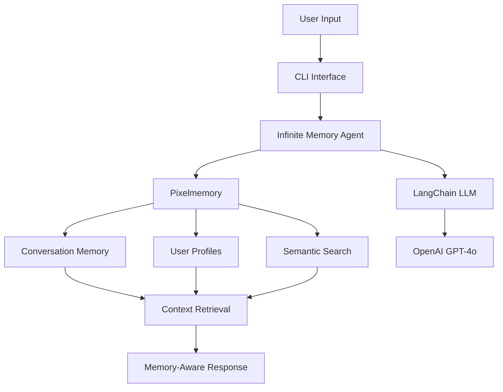

# 🧠 Infinite Memory LangChain Agent

**Experience what it's like to have an AI that truly remembers everything.**

This interactive CLI agent demonstrates the power of persistent memory in AI conversations using Pixelmemory + LangChain.

## Features

- **Persistent Memory**: Never forgets anything across sessions
- **Semantic Search**: Finds relevant past conversations automatically  
- **User Profiles**: Learns and remembers information about users
- **Topic Tracking**: Automatically categorizes conversations
- **Memory Search**: Search through all past interactions
- **Multi-User Support**: Different users have isolated memory spaces

## Quick Start

```bash
# 1. Install dependencies
pip install pixelmemory langchain langchain-openai

# 2. Set your OpenAI API key
export OPENAI_API_KEY="your-key-here"

# 3. Start chatting!
python cli.py
```

## Demo Experience

```bash
$ python cli.py

🧠 INFINITE MEMORY LANGCHAIN AGENT
==================================================================
An AI that remembers everything you tell it!

Commands:
  /help     - Show all commands
  /stats    - Show memory statistics
  /search   - Search through all memories
  /profile  - View user profile
  /history  - View conversation history
  /user     - Switch user
  /exit     - Exit the program

Just type normally to chat!
==================================================================

👤 User Setup
What's your name? (or user ID): Alice

✅ Welcome Alice!
📝 Session: Alice_20241201_143022

💬 Start chatting with MemoryBot!
Type /help for commands or just chat normally...

Alice: Hi! I'm a data scientist working on customer churn prediction
MemoryBot: Hello Alice! It's wonderful to meet a data scientist! Customer churn prediction is such an important and challenging problem. I'll remember that you're working on this project. What specific aspects of churn prediction are you focusing on? Are you dealing with feature engineering, model selection, or perhaps data preprocessing challenges?

Alice: I'm having trouble with feature selection
MemoryBot: I remember you're working on customer churn prediction! Feature selection is crucial for churn models. Let me help you with some proven techniques...

Alice: /stats

📊 Memory Statistics for Alice
----------------------------------------
Total memories: 4
Topics discussed: ai_ml, work
Topic distribution:
  ai_ml: 3 messages
  work: 1 messages

Alice: /search feature selection

🔍 Searching memories for: 'feature selection'
--------------------------------------------------
  1. [2024-12-01] user: I'm having trouble with feature selection... 
     Topic: ai_ml, Similarity: 0.742

Alice: /exit
👋 Goodbye!
```

## Interactive Commands

- **Chat normally**: Just type your message and the agent responds with memory context
- **`/stats`**: See how many memories you have and topic distribution
- **`/search <query>`**: Find past conversations about specific topics
- **`/profile`**: View what the agent has learned about you
- **`/history`**: See recent conversation history
- **`/user`**: Switch to a different user to test memory isolation
- **`/exit`**: Quit the program

## How Memory Works

### Persistent Across Sessions
Start a conversation, exit the program, restart it - the agent remembers everything:

```bash
# Session 1
Alice: I'm working on a machine learning project
MemoryBot: Tell me more about your ML project!

# Exit and restart

# Session 2 (hours/days later)
Alice: Hi again!
MemoryBot: Welcome back Alice! How is your machine learning project going?
```

### Semantic Memory Search
The agent automatically finds relevant past conversations:

```bash
Alice: I need help with data preprocessing
# Agent searches memory and finds:
# - Previous conversations about data
# - Related ML discussions  
# - Relevant context from past sessions
```

### Multi-User Memory Isolation
Different users have completely separate memory spaces:

```bash
Alice: I love Python programming
/user
Bob: I prefer JavaScript
# Alice and Bob's conversations are completely separate
```

## Architecture



## Built With

- **[Pixelmemory](https://github.com/pixeltable/pixelmemory)** - Persistent multimodal memory
- **[Pixeltable](https://github.com/pixeltable/pixeltable)** - Declarative data infrastructure  
- **[LangChain](https://github.com/langchain-ai/langchain)** - LLM framework
- **OpenAI GPT-4o-mini** - Language model

## Try It Now!

```bash
cd infinite-memory-langchain-agent
python cli.py --user YourName
```

Experience what persistent AI memory feels like firsthand! 🚀
